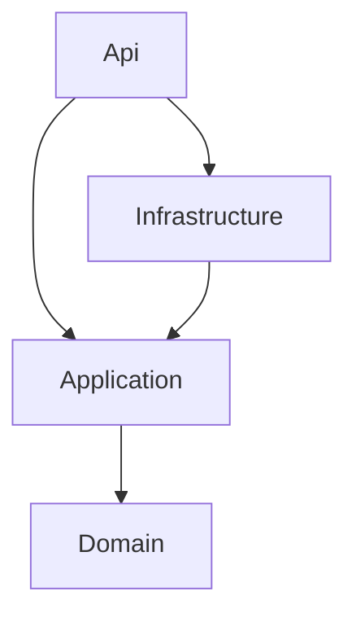

# Mimari Testler (Architecture Tests)

`test/RestaurantManagement.Api.ArchTests` projesi, Clean Architecture kurallarını derleme sonrası otomatik olarak doğrular. Bir kural ihlal edilirse test başarısız olur ve ihlal eden tip isimleri hata mesajında listelenir.

## Araçlar

- **xUnit** - Test framework'ü
- **[NetArchTest.Rules](https://github.com/BenMorris/NetArchTest)** - Fluent API ile bağımlılık, isimlendirme ve yapı kuralları
- **Reflection** - NetArchTest'in ifade edemediği kurallar için (setter, static alan, generic arayüz vb.)

## Çalıştırma

```bash
dotnet test test/RestaurantManagement.Api.ArchTests
```

## Proje Yapısı

| Dosya | Sorumluluk |
| --- | --- |
| `ArchitectureTestHelper.cs` | Assembly referansları, namespace sabitleri ve ortak assert yardımcıları |
| `LayerDependencyTests.cs` | Katmanlar arası bağımlılık kuralı |
| `DomainRulesTests.cs` | Domain katmanı kuralları |
| `ApplicationRulesTests.cs` | Application katmanı (CQRS) kuralları |
| `InfrastructureRulesTests.cs` | Infrastructure katmanı kuralları |
| `ApiRulesTests.cs` | Api (sunum) katmanı kuralları |
| `GeneralConventionTests.cs` | Tüm katmanlar için ortak konvansiyonlar |

## Yardımcı Metotlar

| Metot | Açıklama |
| --- | --- |
| `AssertSuccessful(TestResult)` | NetArchTest sonucunu doğrular, ihlal eden tipleri mesaja ekler |
| `AssertNoViolations(IEnumerable<string>)` | Reflection tabanlı kontrollerde ihlal listesinin boş olduğunu doğrular |
| `ImplementsOpenGeneric(Type)` | Tipin verilen open generic arayüzü (`ICommand<>` vb.) implement edip etmediğini kontrol eder |
| `ProjectTypes(Assembly)` | Compiler tarafından üretilen tipleri hariç tutarak proje tiplerini döner |

## Kurallar

### Katman Bağımlılıkları (`LayerDependencyTests`)



| Test | Kural |
| --- | --- |
| `Domain_ShouldNotDependOnOtherLayers` | Domain; Application, Infrastructure ve Api'ye bağımlı olamaz |
| `Application_ShouldNotDependOnInfrastructureOrApi` | Application; Infrastructure ve Api'ye bağımlı olamaz |
| `Infrastructure_ShouldNotDependOnApi` | Infrastructure, Api'ye bağımlı olamaz |
| `Domain_ShouldNotDependOnFrameworksOrPackages` | Domain; EF Core, Dapper, `Microsoft.Data`, `System.Data`, ASP.NET Core, Mediator, FluentValidation ve `Microsoft.Extensions` kullanamaz |
| `Application_ShouldNotDependOnInfrastructurePackages` | Application; EF Core, Dapper, `Microsoft.Data`, `System.Data` ve ASP.NET Core kullanamaz |
| `Api_ShouldNotDependOnInfrastructure_ExceptCompositionRoot` | Api tipleri Infrastructure'a bağımlı olamaz (composition root olan `Program` hariç tutulur) |

### Domain (`DomainRulesTests`)

| Test | Kural |
| --- | --- |
| `EntitiesInEntitiesNamespace_ShouldInheritBaseEntity` | `Entities` altındaki sınıflar (`*Status` enum'ları hariç) `BaseEntity`'den türemeli |
| `AggregateRoots_ShouldBeEntities` | `IAggregateRoot` implement eden tipler `BaseEntity`'den türemeli |
| `Entities_ShouldNotHavePublicSetters` | Entity property'lerinde public setter olamaz (`init` hariç); durum metotlarla değişir |
| `Entities_ShouldNotBeSealed` | Entity'ler `sealed` olamaz |
| `DomainTypes_ShouldNotUseApplicationOrApiNamingSuffixes` | Domain tipleri `Dto`, `Request`, `Response`, `Command`, `Query`, `Handler` ile bitemez |

### Application (`ApplicationRulesTests`)

| Test | Kural |
| --- | --- |
| `Commands_ShouldEndWithCommand` | `ICommand<>` implement eden tipler `Command` ile bitmeli |
| `Queries_ShouldEndWithQuery` | `IQuery<>` implement eden tipler `Query` ile bitmeli |
| `RequestsAndHandlers_ShouldResideInFeatureNamespaces` | Command, query ve handler'lar `Common` veya kök namespace'te değil, feature namespace'inde olmalı |
| `Handlers_ShouldEndWithHandlerAndBeSealed` | Handler'lar `Handler` ile bitmeli ve `sealed` olmalı |
| `EveryCommandAndQuery_ShouldHaveExactlyOneHandler` | Her command/query için tam olarak bir handler bulunmalı |
| `Handlers_ShouldNotDependOnOtherHandlers` | Handler'lar birbirine bağımlı olamaz |
| `Validators_ShouldEndWithValidator` | `AbstractValidator<>`'dan türeyen sınıflar `Validator` ile bitmeli |
| `RepositoryAndServiceInterfaces_ShouldResideInApplicationCommonInterfaces` | `*Repository`, `*Service`, `*UnitOfWork` arayüzleri `Application.Common.Interfaces` altında olmalı |
| `CommandsAndQueries_ShouldBeImmutable` | Command ve query'lerde public setter olamaz (`init` hariç) |

### Infrastructure (`InfrastructureRulesTests`)

| Test | Kural |
| --- | --- |
| `Repositories_ShouldEndWithRepositoryAndImplementApplicationInterface` | `Repositories` altındaki sınıflar `Repository` ile bitmeli (veya `UnitOfWork` olmalı) ve Application/Domain arayüzü implement etmeli |
| `ReadServices_ShouldEndWithReadServiceAndImplementApplicationInterface` | `ReadServices` altındaki sınıflar `ReadService` ile bitmeli ve Application arayüzü implement etmeli |
| `EntityConfigurations_ShouldEndWithConfiguration` | `IEntityTypeConfiguration<>` implement edenler `Configuration` ile bitmeli |
| `RepositoriesAndReadServices_ShouldBeSealed` | Repository ve read service sınıfları `sealed` olmalı |
| `Repositories_ShouldNotDependOnReadServices` | Yazma tarafı (EF Core) okuma tarafına (Dapper) bağımlı olamaz |

### Api (`ApiRulesTests`)

| Test | Kural |
| --- | --- |
| `Endpoints_ShouldEndWithEndpoints` | `Endpoints` altındaki tipler `Endpoints` ile bitmeli |
| `Endpoints_ShouldNotDependOnDomainEntities` | Endpoint'ler Domain'e bağımlı olamaz |
| `Endpoints_ShouldNotDependOnRepositoriesOrDbContext` | Endpoint'ler Infrastructure, `Application.Common.Interfaces` ve EF Core'a bağımlı olamaz |
| `Contracts_ShouldResideInApiAndEndWithRequest` | `Contracts` altındaki tipler `Request` veya `Response` ile bitmeli |
| `Contracts_ShouldNotDependOnDomain` | Contract'lar Domain'e bağımlı olamaz |

### Genel Konvansiyonlar (`GeneralConventionTests`)

| Test | Kural |
| --- | --- |
| `Interfaces_ShouldStartWithI` | Tüm arayüz isimleri `I` + büyük harf ile başlamalı |
| `Types_ShouldNotHaveStaticMutableState` | Static, `readonly` olmayan alan bulunamaz |
| `Namespaces_ShouldStartWithAssemblyName` | Namespace'ler assembly adıyla başlamalı |
| `ConcreteClasses_ShouldBeSealedOrAbstractOrStaticOrEntities` | Application ve Infrastructure'daki somut sınıflar `sealed`, `abstract` veya `static` olmalı (`DbContext` ve `*Dto` hariç) |

## Yeni Kural Ekleme

1. İlgili katmanın test sınıfına `[Fact]` metodu ekleyin.
2. Tip bazlı kurallar için `Types.InAssembly(...)` ile NetArchTest, property/alan bazlı kurallar için reflection kullanın.
3. Sonucu `AssertSuccessful` veya `AssertNoViolations` ile doğrulayın.
4. Bu dosyadaki ilgili tabloyu güncelleyin.
