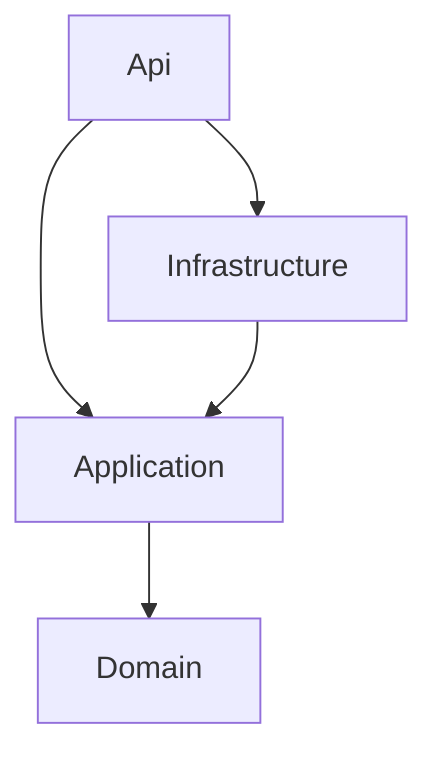

# Restoran Sipariş ve Mutfak Yönetim Sistemi - Clean Architecture

Bu proje, **Clean Architecture** kullanılarak geliştirilmiş bir restoran sipariş ve mutfak yönetim sistemidir. .NET 10 ve modern yazılım geliştirme prensipleri ile oluşturulmuştur.

## 🎯 Proje Hakkında

Clean Architecture, uygulamayı **bağımlılık kuralına** göre konsantrik katmanlara ayıran bir mimari yaklaşımdır. İş kuralları (Domain) en içte yer alır ve hiçbir dış katmana (veritabanı, web framework'ü vb.) bağımlı değildir. Bağımlılıklar her zaman dıştan içe doğrudur; altyapı detayları (EF Core, Dapper, SQLite) değiştirilse bile iş mantığı etkilenmez.

## 🏗️ Mimari Yapı

### 📁 Klasör Yapısı

```
Clean/
│
├── src/
│   │
│   ├── RestaurantManagement.Domain/           # 🏗️ En iç katman - iş kuralları
│   │   ├── Common/
│   │   │   ├── BaseEntity.cs                  # Ortak entity tabanı
│   │   │   ├── IAggregateRoot.cs              # Aggregate root işaretleyicisi
│   │   │   └── DomainResult.cs                # Domain işlem sonucu
│   │   └── Entities/
│   │       ├── Table.cs                       # Masa entity'si
│   │       ├── TableStatus.cs                 # Masa durumu enum
│   │       ├── MenuItem.cs                    # Menü öğesi entity'si
│   │       ├── Order.cs                       # Sipariş aggregate'i
│   │       ├── OrderItem.cs                   # Sipariş kalemi entity'si
│   │       └── OrderStatus.cs                 # Sipariş durumu enum
│   │
│   ├── RestaurantManagement.Application/      # 📋 Use case'ler (CQRS)
│   │   ├── Common/
│   │   │   ├── Behaviors/
│   │   │   │   └── ValidationBehavior.cs      # Otomatik validation pipeline
│   │   │   ├── DTOs/                          # MenuItemDto, OrderDto, OrderItemDto, TableDto
│   │   │   ├── Interfaces/                    # Repository, ReadService ve IUnitOfWork arayüzleri
│   │   │   └── Result.cs                      # Result pattern implementation
│   │   ├── Tables/
│   │   │   ├── GetAllTables/                  # Query + QueryHandler
│   │   │   └── UpdateTableStatus/             # Command + CommandHandler + Validator
│   │   ├── MenuItems/
│   │   │   └── GetMenuItems/                  # Query + QueryHandler
│   │   ├── Orders/
│   │   │   ├── CreateOrder/                   # Command + CommandHandler + Validator
│   │   │   ├── UpdateOrderStatus/             # Command + CommandHandler + Validator
│   │   │   └── GetKitchenOrders/              # Query + QueryHandler
│   │   └── DependencyInjection.cs             # AddApplication()
│   │
│   ├── RestaurantManagement.Infrastructure/   # 🔧 Dış dünya detayları
│   │   ├── Data/
│   │   │   ├── RestaurantDbContext.cs         # EF Core DbContext
│   │   │   └── DbConnectionFactory.cs         # Dapper için bağlantı fabrikası
│   │   ├── Repositories/                      # Yazma tarafı (EF Core) + UnitOfWork
│   │   ├── ReadServices/                      # Okuma tarafı (Dapper)
│   │   └── DependencyInjection.cs             # AddInfrastructure()
│   │
│   └── RestaurantManagement.Api/              # 🌐 Sunum katmanı ve composition root
│       ├── Endpoints/                         # Minimal API endpoint'leri
│       ├── Contracts/                         # HTTP request modelleri
│       ├── Common/
│       │   └── ResultHelper.cs                # Result -> HTTP yanıt dönüşümü
│       └── Program.cs                         # Application startup
│
└── test/
    ├── RestaurantManagement.Api.Tests/             # Birim testleri (Domain, Application, Api)
    ├── RestaurantManagement.Api.IntegrationTests/  # Repository ve read service testleri
    ├── RestaurantManagement.Api.FunctionalTests/   # Uçtan uca endpoint testleri
    └── RestaurantManagement.Api.ArchTests/         # Mimari kural testleri
```

### Katmanlar Arası Bağımlılık



`Api`, yalnızca composition root olarak `Infrastructure`'a referans verir; endpoint'ler yalnızca `Application` katmanıyla konuşur. `Domain` hiçbir katmana bağımlı değildir.

### Temel Özellikler

#### 1. **Bağımlılık Kuralı**

- Bağımlılıklar her zaman dıştan içe doğrudur
- Application katmanı arayüzleri tanımlar, Infrastructure bunları implement eder (Dependency Inversion)
- Bu kurallar `ArchTests` projesi ile otomatik olarak doğrulanır

#### 2. **CQRS Pattern**

- **Commands:** Veri değiştiren işlemler (`CreateOrder`, `UpdateOrderStatus`, `UpdateTableStatus`) - EF Core repository'leri ve `IUnitOfWork` üzerinden
- **Queries:** Veri okuyan işlemler (`GetMenuItems`, `GetAllTables`, `GetKitchenOrders`) - Dapper tabanlı read service'ler üzerinden
- Mediator kütüphanesi ile implement edilmiştir (source generator based, high performance)

#### 3. **Zengin Domain Modeli**

- Entity'lerin setter'ları `private`'tır, durum değişiklikleri metotlarla yapılır (`Order.StartPreparation()`, `Table.Occupy()` vb.)
- İş kuralı ihlalleri exception yerine `DomainResult` ile döner
- `Order` ve `Table` birer aggregate root'tur

#### 4. **Result Pattern**

- Handler'lar `Result<T>` döner (`Success`, `NotFound`, `Conflict`, `Failure`)
- `ResultHelper.ToApiResult()` bu sonucu HTTP 200/201, 404, 409 veya 400 yanıtına çevirir

## 🚀 Teknolojiler

- **.NET 10** - Modern web API framework
- **ASP.NET Core** - Minimal API
- **Entity Framework Core 10** - ORM (SQLite) - yazma tarafı
- **Dapper** - Micro ORM - okuma tarafı
- **Mediator** - Source generator tabanlı, yüksek performanslı CQRS implementasyonu ([martinothamar/Mediator](https://github.com/martinothamar/Mediator))
- **FluentValidation** - Input validation
- **Scalar/OpenAPI** - API dokümantasyonu
- **xUnit, NetArchTest.Rules, Mvc.Testing** - Test altyapısı

## 📦 Kurulum ve Çalıştırma

### Gereksinimler

- .NET 10 SDK
- Visual Studio 2022 / VS Code / JetBrains Rider

### Adımlar

1. **Projeyi klonlayın:**

```bash
git clone <repository-url>
cd ArchitecturePatterns/Examples/Clean
```

2. **Bağımlılıkları yükleyin:**

```bash
dotnet restore
```

3. **Projeyi çalıştırın:**

```bash
cd src/RestaurantManagement.Api
dotnet run
```

4. **Scalar UI'a gidin:**

```
http://localhost:5000/scalar
```

> Veritabanı (`restaurant.db`, SQLite) ilk çalıştırmada otomatik oluşturulur. Bağlantı dizesi `ConnectionStrings:RestaurantDb` ile değiştirilebilir.

### Testleri Çalıştırma

```bash
dotnet test
```

## 🔍 API Endpoints

### Masa Yönetimi (Tables)

#### Tüm masaları listele

```http
GET /api/tables
```

**Response:**

```json
[
  {
    "id": 1,
    "tableNumber": 1,
    "capacity": 4,
    "status": "Available",
    "reservedAt": null
  }
]
```

#### Masa durumunu güncelle

```http
PUT /api/tables/{tableId}/status
```

**Request Body:**

```json
{
  "newStatus": "Reserved" // Available, Occupied, Reserved, OutOfService
}
```

### Menü Yönetimi (MenuItems)

#### Menü öğelerini listele

```http
GET /api/menuitems
```

**Response:**

```json
[
  {
    "id": 1,
    "name": "Margherita Pizza",
    "category": "Pizza",
    "price": 12.99,
    "description": null,
    "isAvailable": true
  }
]
```

### Sipariş Yönetimi (Orders)

#### Yeni sipariş oluştur

```http
POST /api/orders
```

**Request Body:**

```json
{
  "tableId": 1,
  "items": [
    {
      "menuItemId": 1,
      "quantity": 2,
      "specialInstructions": "Extra cheese"
    },
    {
      "menuItemId": 7,
      "quantity": 2,
      "specialInstructions": null
    }
  ],
  "notes": "Birthday celebration"
}
```

**Response:** `201 Created`

```json
{
  "id": 1,
  "orderNumber": "ORD-20251021-1A2B3C4D",
  "tableId": 1,
  "orderDate": "2025-10-21T14:30:22.123Z",
  "status": "Pending",
  "totalAmount": 31.96,
  "notes": "Birthday celebration",
  "orderItems": [
    {
      "id": 1,
      "menuItemName": "Margherita Pizza",
      "quantity": 2,
      "price": 12.99,
      "specialInstructions": "Extra cheese"
    }
  ]
}
```

Sipariş oluşturulduğunda masa otomatik olarak `Occupied` durumuna geçer.

#### Sipariş durumunu güncelle

```http
PUT /api/orders/{orderId}/status
```

**Request Body:**

```json
{
  "newStatus": "InPreparation" // InPreparation, Ready, Served, Cancelled
}
```

Geçerli akış: `Pending -> InPreparation -> Ready -> Served`. `Cancelled`, servis edilmiş siparişler dışında her aşamada kullanılabilir.

#### Mutfak siparişlerini listele

```http
GET /api/orders/kitchen
```

**Response:**

```json
[
  {
    "id": 1,
    "orderNumber": "ORD-20251021-1A2B3C4D",
    "tableId": 1,
    "orderDate": "2025-10-21T14:30:22.123Z",
    "status": "InPreparation",
    "totalAmount": 31.96,
    "notes": null,
    "orderItems": [
      {
        "id": 1,
        "menuItemName": "Margherita Pizza",
        "quantity": 2,
        "price": 12.99,
        "specialInstructions": "Extra cheese"
      }
    ]
  }
]
```

### Hata Yanıtları

| Durum | HTTP Kodu |
| --- | --- |
| Validation hatası / geçersiz istek | `400 Bad Request` |
| Kayıt bulunamadı | `404 Not Found` |
| İş kuralı çakışması (ör. dolu masaya sipariş) | `409 Conflict` |

```json
{
  "error": "Table 1 is not available for orders",
  "errorDetails": {}
}
```

## 💡 Clean Architecture'ın Avantajları

### ✅ Artıları

1. **Framework Bağımsızlığı**
   - İş mantığı ASP.NET Core, EF Core veya Dapper'a bağımlı değildir
   - Altyapı teknolojisi değiştirilebilir

2. **Yüksek Test Edilebilirlik**
   - Domain ve Application katmanları veritabanı olmadan test edilir
   - Her katman için ayrı test projesi bulunur

3. **Net Sorumluluk Ayrımı**
   - Her katmanın görevi ve bağımlılık yönü belirlidir
   - Mimari kurallar otomatik testlerle korunur

4. **Uzun Vadeli Bakım Kolaylığı**
   - İş kuralları tek bir yerde (Domain) toplanır
   - Dış detaylar iş mantığını etkilemeden değiştirilebilir

### ⚠️ Eksileri

1. **Boilerplate Kod**
   - Basit bir özellik bile birden fazla katmanı ve dosyayı etkiler
   - Arayüz, DTO ve mapping sayısı artar

2. **Öğrenme Eğrisi**
   - Katmanlar, bağımlılık kuralı ve CQRS kavramlarının anlaşılması gerekir

3. **Feature'ların Dağılması**
   - Tek bir özelliğe ait kod birden fazla projeye dağılır

## 🎓 Öğrenme Noktaları

### 1. Katman Organizasyonu

Bir özellik (ör. `CreateOrder`) katmanlara şu şekilde dağılır:

```
Api/Endpoints/OrderEndpoints.cs                                     # HTTP endpoint
Api/Contracts/Orders/CreateOrderRequest.cs                          # Request modeli
Application/Orders/CreateOrder/CreateOrderCommand.cs                # Command
Application/Orders/CreateOrder/CreateOrderCommandHandler.cs         # Use case
Application/Orders/CreateOrder/CreateOrderCommandValidator.cs       # Validation kuralları
Domain/Entities/Order.cs                                            # İş kuralları
Infrastructure/Repositories/OrderRepository.cs                      # Veri erişimi
```

### 2. CQRS with Mediator

```csharp
// Command
public sealed record CreateOrderCommand(int TableId, List<OrderItemInput> Items, string? Notes)
    : ICommand<Result<OrderDto>>;

// Handler
public sealed class CreateOrderCommandHandler(IUnitOfWork unitOfWork)
    : ICommandHandler<CreateOrderCommand, Result<OrderDto>>
{
    public async ValueTask<Result<OrderDto>> Handle(CreateOrderCommand command, CancellationToken cancellationToken)
    {
        // Business logic here
    }
}

// Usage in Endpoint
var result = await sender.Send(new CreateOrderCommand(request.TableId, items, request.Notes), ct);
return result.ToApiResult();
```

### 3. Validation

```csharp
public sealed class CreateOrderCommandValidator : AbstractValidator<CreateOrderCommand>
{
    public CreateOrderCommandValidator()
    {
        RuleFor(x => x.TableId).GreaterThan(0);
        RuleFor(x => x.Items).NotEmpty();
    }
}
```

Validator'lar `ValidationBehavior` pipeline'ı ile handler çalışmadan önce otomatik olarak devreye girer.

### 4. Mimari Testler

```csharp
// Aggregate root'lar BaseEntity'den türemeli (NetArchTest.Rules)
var result = Types.InAssembly(DomainAssembly)
    .That().ImplementInterface(typeof(IAggregateRoot))
    .Should().Inherit(typeof(BaseEntity))
    .GetResult();
```

## 🧪 Test Stratejisi

| Proje | Amaç |
| --- | --- |
| `RestaurantManagement.Api.Tests` | Domain, Application (handler, validator, behavior) ve Api birim testleri |
| `RestaurantManagement.Api.IntegrationTests` | Repository, read service ve UnitOfWork testleri (SQLite) |
| `RestaurantManagement.Api.FunctionalTests` | `WebApplicationFactory` ile uçtan uca endpoint testleri |
| `RestaurantManagement.Api.ArchTests` | Katman bağımlılığı ve isimlendirme kurallarının doğrulanması |

## 🔄 Diğer Mimarilerle Karşılaştırma

| Özellik | Clean/Onion | Vertical Slice | Hexagonal |
|---------|-------------|----------------|-----------|
| **Organizasyon** | Katman bazlı | Feature bazlı | Katman bazlı |
| **Kod Lokasyonu** | Katmanlara dağılmış | Her şey bir arada | Core + Adapters |
| **Yeni Feature** | Orta | Çok kolay | Orta |
| **Öğrenme Eğrisi** | Orta-Yüksek | Düşük | Yüksek |
| **Boilerplate** | Yüksek | Minimum | Yüksek |
| **Test Edilebilirlik** | Çok yüksek | Yüksek | Çok yüksek |

## 📚 Kaynaklar

- [Robert C. Martin - The Clean Architecture](https://blog.cleancoder.com/uncle-bob/2012/08/13/the-clean-architecture.html)
- [Mediator - Source Generator Based](https://github.com/martinothamar/Mediator)
- [CQRS Pattern](https://martinfowler.com/bliki/CQRS.html)
